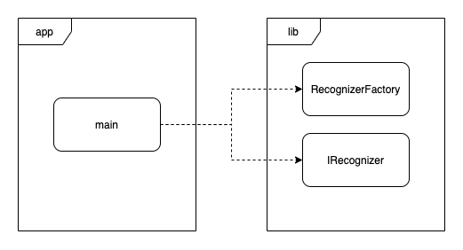
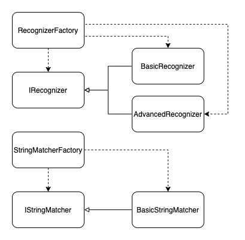

# intent-recognizer

Intent recognizer is a project aimed at deriving intent from natural language. It is especially useful in human machine interaction,
where the human operating the machine can choose the next action the machine should perform based on natural language commands.
It can be used inside the car - for navigation, entertainment or obtaining information from the internet, for smart home appliances and so on.

## Development View

To build the app, please run
```bash
mkdir build && cd build
cmake ..
make

# to run the tests
./src/lib/intent_recognizer_test

# to run the app
./src/bin/app -h
# Allowed options:
#   -h, --help               show help message
#   -s, --sentence arg       user sentence to guess intent for
#   -t, --type arg (=basic)  type of recognizer to use, can be 'basic' or 'advanced'
#   -m, --model arg          path to model, needed only by the 'advanced' type

# example calls
./src/bin/app -s "What is the weather like today?"
Intent: Get Weather

./src/bin/app -s "What is the weather like in Paris today?"
Intent: Get Weather City

./src/bin/app -s "What's my schedule at 16:00 PM tomorrow?"
Intent: Check Calendar

./src/bin/app -s "Please elaborate an interesting fact."
Intent: Get Fact
```

### Backlog

See the backlog [here](BACKLOG.md).

## Logical View

The intent recognizer is built around a static library with the same name.

For the purpose of actually using the product, this repository includes a proof of concept CLI app.



### The `intent-recognizer` lib

Many things can be considered when writing a library that deals with noisy or rather uncertain input.
Among others, we could name a few

* multiple languages
* the spelling, which can be wrong

For the moment it supports English language only and no spelling fixing. 
Also for the sake of simplicity, all versions of the library will support a limited set of intents, e.g.

* Get Weather
* Get Weather City
* Check Calendar
* Get Fact

The architecture of the intent-recognizer lib is as follows



As you can see in the picture above, the user of the library can instantiate different types of recognizers, without being coupled to those respective implementations, by means of a common interface.

#### The `basic` version

The basic version of the intent recognizer is a very simple one. The "guessing" of intent is based
on simple regular expressions fit for the four recognizable intents.
This version is assuming the input is strictly matching the expected patterns (which are case insensitive), so it doesn't allow for much flexibility.

#### The `advanced` version

The advanced version uses a simple forward neural network for predicting.
The quality of the recognitions is dependent on the richness and quality of the training set and
on the quality of the features chosen, respectively. Also, the architecture of the neural network
influences the end result.

The current implementation uses the `bag of words` approach, which simply counts the occurrence of some
predefined keywords in the given sentence to create the feature vector.

Note: although it would be expected that the advanced recognizer would handle natural language better,
given the present training data and feature vector definitions, the results are over fit to the (small)
training set. That's why the results are not satisfactory. By spending a few hours on increasing the
training set and including more keywords in the bag of words, better results could be achieved.

To train the neural network
```bash
# These have to be run after cmake was called
# TODO: move to cmake custom target
cd script
virtualenv venv
source venv/bin/activate
pip install -r requirements.txt

python ./train.py
python ../build/src/lib/frugally_deep/keras_export/convert_model.py keras_model.h5 model.json
# script/model.json contains the trained model
```

To run the advanced recognizer
```bash
build/src/bin/app -s "Is there any free spot in my schedule today?" -t advanced -m script/model.json
# Intent: Check Calendar
```