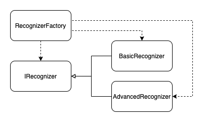

# intent-recognizer

Intent recognizer is a project aimed at deriving intent from natural language. It is especially useful in human machine interaction,
where the human operating the machine can choose the next action the machine should perform based on natural language commands.
It can be used inside the car - for navigation, entertainment or obtaining information from the internet, for smart home appliances and so on.

## Logical View

The intent recognizer is built around a static library with the same name.

For the purpose of actually using the product, this repository includes a proof of concept CLI app.

### The `intent-recognizer` lib

Many things can be considered when writing a library that deals with noisy or rather uncertain input.
Among others, we could name a few

* multiple languages
* the spelling, which can be wrong. To tackle this, input could be first filtered/matched to common words.

To limit the scope of this app, for the moment we support English language only.

Spelling checking however, will be implemented at least in some simple form. Sentences will be checked and curated before being fed to the recognizer.

The architecture of the intent-recognizer lib is as follows

For the sake of simplicity, all versions of the library will support a limited set of intents, e.g.

* Get Weather
* Get Weather City
* Check Calendar
* Get Fact

The first version of the intent recognizer is a very basic one. The "guessing" of intent is based
on the appearence of certain words in the sentences.
